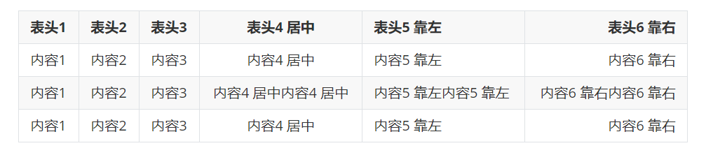

# Markdown 从入门到精通

> Markdown，我们程序员自己的 Word  
> `System.out.println("Hello, Markdown; Hello, Word");`  
> ——我自己

# Markdown 是什么？

- `Markdown` 是一种轻量级标记语言，创始人为约翰·格鲁伯（John Gruber）。
- `Markdown` 允许人们使用易读易写的纯文本格式编写文档，更加侧重于**专注于文字内容而非格式**
- `Markdown` 编写的文档可以导出 HTML、Word、图像、PDF 等多种格式的文档。
- `Markdown` 编写的文档后缀为 `.md`，`.markdown`。

简而言之，`Markdown` 是现在程序猿界最流行的写作语言。国外的 GitHub、Reddit、Diaspora、Stack Exchange、OpenStreetMap 、SourceForge 等；国内的 CSDN、简书、掘金、博客园、知乎等，都是基于 `Markdown` 所书写的！

因此，在未来我们的开发文档、开发工作中，大家都要以 `Markdown` 为标准文档格式进行书写，本文主要介绍 `Markdown` 的基本语法，由于 `Markdown` 本身非常简单，因此各位通过数十分钟的学习就能很快上手，**从入门到精通！**

参考网址：[Markdown 官网网站](https://markdown.com.cn/)

# 工具

编写 markdown 的工具主要有：

1. Typora
2. **VS Code**
3. 各大云笔记文档

Typora 对阅读友好，个人书写体验感觉一般。编辑的时候各类显性语法都会隐藏起来，快捷键方面不如 VS Code，有点难以编辑。而且 Typora 正式版是收费的，哥们儿是白嫖党（但是我也有破解的 [Typora 软件安装与破解](https://k1vrx6ifqoq.feishu.cn/wiki/No4Pw6zVui1xtGkkSywcrGDWnyT?fromScene=spaceOverview)）

VS Code 是我个人最喜欢用也最常用的编辑器。配合 `Markdown All in One` 插件编辑阅读体验满分，而且 VS Code 本身也是我常用的写前端、算法代码的编辑器，高亮什么的也非常合理。也最推荐大家使用这个编辑器。

各大云笔记文档，主要是用于协同开发，比如**飞书云文档**（后续我们也会使用飞书云文档作为合作笔记形式）。但是编辑阅读体验就中规中矩了。有一些特殊的优化或者说适配与 VS Code 有所区别。

总结：使用 VS Code 进行编辑和撰写操作，使用云笔记进行合作文档笔记

# **语法**

本次授课的核心，显示效果以 Typora 作为展示

## 标题

标题一共分为六级标题，大小、层级依次缩小。

标题的语法是 `#`，`#` 越多，说明标题层级越小

```markdown
# 一级标题
## 二级标题
### 三级标题
#### 四级标题
##### 五级标题
###### 六级标题
正文
```


一般只会使用一二三级标题，再往下就和正文没什么区别了，区分度很低，不推荐使用

## 特殊字体

强调用的字体主要有两种，分别是斜体与粗体。在 markdown 中，`*` 和 `_` 的作用是一致的，可以相互替换。

```markdown
**我是粗体**
*我是斜体*
***我是粗斜体***

__我是粗体__
_我是斜体_
___我是粗斜体___
```


## 引用

引用需要使用 `>`，引用中间可以使用多个层级进行嵌套

```markdown
> 引用1
> 引用2
> > 嵌套引用1
> > > 嵌套引用2
```


## 列表

列表主要有两种：有序列表和无序列表，对于无序列表，有 todoList 的附加格式。

```markdown
- 无序列表1
- 无序列表2
- 无序列表3

1. 有序列表1
2. 有序列表2
3. 有序列表3

- [x] todo1
- [ ] todo2
- [ ] todo3
```


注意：TodoList 格式的空格中是 `x` 而不是 `×`，是“艾克斯”而不是“乘法”

## 链接

链接有两种表示方式，一种是赋予文字以链接，点击文字即可跳转，另一种就是纯链接。

```markdown
[百度一下](https://www.baidu.com)
<https://www.baidu.com>
```


## 图片

图片从某种程度上来说，也算一种特殊的链接。它的链接路径赫然是这个图片的本地路径或网络路径。

```markdown

```


一般情况下，都是网络地址，部署使用图床对图片进行存储，在 markdown 文档中只需要拿到图床中的链接即可随时显示出图片。详见：[MinIO 的部署与使用](https://k1vrx6ifqoq.feishu.cn/wiki/AKhgw8nH2iIcaJk6t3TcSmMonPb)

## 分割线

分割线的语法是三个及以上的 `-`，即可组成一整行的分割线，长度与 `-` 的数量无关

```markdown
分割线前
---
分割线后
```


## 删除线

删除线可以将中间包裹的文字呈现出删除的效果、

```markdown
~~完蛋，我被删除了！~~
```


## 下划线

这里引入一个要点：Markdown 文档其实本质上就是 html 页面的规范范式文档，在各大编辑器中，比如 Typora，就是一个专门用来渲染 markdown 文档的浏览器。因此在 markdown 文档中可以很轻松的嵌入各类 html 标签，甚至样式，比如我想写一个红色的文字：

```html
<div style="color:red">你好</div>
```


包括上面的各类格式，加粗可以用 strong 标签、换行可以用 br、图片可以用 img 等……

在这里，下划线可以使用“u 标签”

```markdown
<u>下划线</u>
```


## 代码块

作为程序员，最常用的 markdown 语法就是用来包裹代码块了。代码块可以在一行内突出某一句代码，如果要突出某一块代码则要使用多行代码块。在代码块内部有着类似编辑器的高亮提示，便于用户阅读代码。

```markdown
Java的输出语句如下：`System.out.println("Hello World")`

​```java

public static void main(args[]) {
    System.out.println("Hello World")
}

\```
```


## 表格

```markdown
|表头1|表头2|表头3|表头4 居中|表头5 靠左|表头6 靠右|
|---|---|---|:-:|:--|--:|
|内容1|内容2|内容3|内容4 居中|内容5 靠左|内容6 靠右|
|内容1|内容2|内容3|内容4 居中内容4 居中|内容5 靠左内容5 靠左|内容6 靠右内容6 靠右|
|内容1|内容2|内容3|内容4 居中|内容5 靠左|内容6 靠右|
```



# 结语

Markdown 还有更多强大的功能，比如数学公式格式化、流程图等，等待我们的发现，但是当下这些语法与内容，已经足够我们进行学习和使用了。什么时候有需要，再去搜索更加强大具体的功能具体怎么写，我在这里就不再赘述。学习资源具体可以参考官方文档，或编辑器的说明文档进行学习。

不同版本的编辑器，其语法有所不同，因此需要根据使用的习惯合理选择自己喜欢的编辑器。
