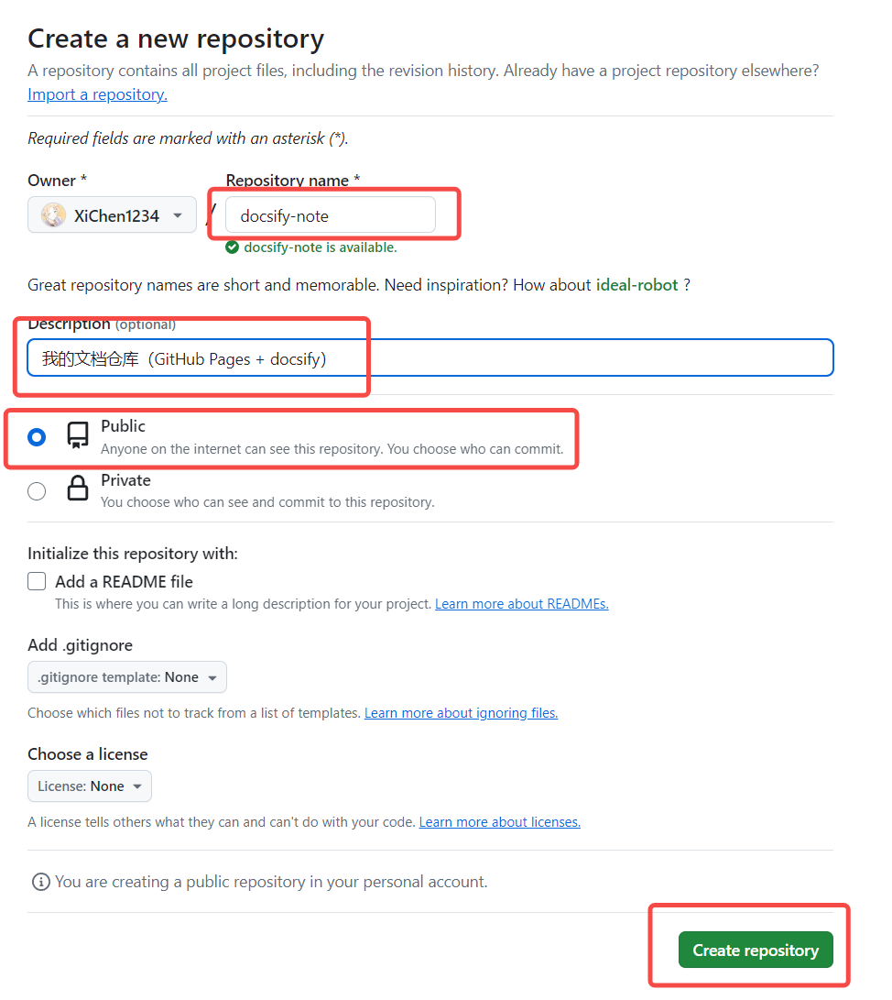
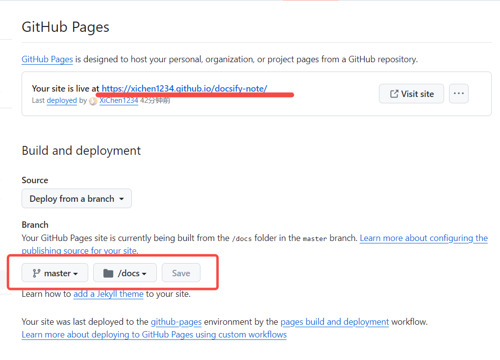
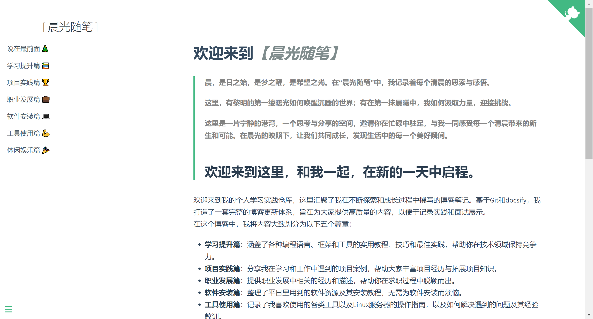

# 基于 docsify 部署在 GitHub Pages 上的个人知识库

# docsify 是什么？

docsify 是一个动态生成文档的网站生成器，能够按照规则和配置解析和加载 markdown 文件，并将其渲染在一个网站当中，实现了简单轻量地部署文档类型网站的功能。

> 官网：[https://docsify.js.org](https://docsify.js.org)
> 中文文档：[https://docsify.js.org/#/zh-cn/](https://docsify.js.org/#/zh-cn/)

# GitHub Pages 是什么？

GitHub Pages 是由 GitHub 代码托管平台提供的一个静态网站部署服务，允许将开放该服务的 GitHub 仓库编译部署为静态项目网站。

> 官网：[https://pages.github.com/](https://pages.github.com/)

## 可能的使用场景：

- 个人网页展示
- 前端项目预览
- 对于开源项目的介绍网页
- **知识库文档展示与实时更新**

# 本项目搭建部署思路

- 在 GitHub 上建立一个知识仓库，基于 docsify 开启 GitHub Pages
- 远程仓库内部存储着我编写的所有知识库文档
- 在本地对该仓库进行克隆，要更改文章或新增文章时在内部进行更新
- 更新结束后，将其使用 Git 命令推送至知识仓库中，完成更新

> 已部署完成，仓库地址：[https://github.com/XiChen1234/docsify-note](https://github.com/XiChen1234/docsify-note)
> 演示地址：[https://xichen1234.github.io/docsify-note/](https://xichen1234.github.io/docsify-note/)
> 未来进行持续更新即可

# 部署流程

## 新建空白的 GitHub 仓库并开启 GitHub Pages



填写以上信息，并进行创建一个空白的 GitHub 仓库

创建成功后，点击 Settings，随后寻找 GitHub Pages 服务



配置 GitHub Pages，即可实现：部署 master 分支上/docs 文件夹中的代码仓库，后期 docsify 就要部署在这个文件夹中

目前 GitHub 中代码仓库的内容为空，因此需要在本地建立新的仓库，并且部署 docsify 使其能够运行在本地服务器。待写好内容之后，直接使用 Git 更新至仓库中。

## 本地安装 docsify

> 需要 node 和 npm 环境
> 官网：[https://docsify.js.org](https://docsify.js.org)

建议全局安装，这有助于在本地初始化和预览网站

```powershell
npm i docsify-cli -g
```

在本地新建一个文件夹用于存储该项目的相关文件，后面初始化和启动都需要这个路径

## 初始化 docsify 项目并打开

**【注意，这些操作都需要进入 docsify 的安装目录】**

> 一般是：`C:\Users\Xi_Chen\AppData\Roaming\npm`，否则执行后面的命令时会无法找到命令。当然，也可以专门为这个配一个环境变量

进入 docsify 的安装目录，进行初始化

```powershell
docsify init [路径] # 初始化/doc
docsify serve [路径] # 启动docsify
```

默认监听地址为：[http://localhost:3000](http://localhost:3000)


启动成功！

## 关联远程仓库

本地 git 仓库的文件目录形式如下：

> - DocsifyNote_Project      // 根目录
>   - README.md            // 用于为 Git 仓库提供预览 README.md 文件
>   - docs                       // 存放 docsify 本体文件
>   - ……

在 DocsifyNote_Project 文件夹中，初始化 git 仓库并关联远程仓库

```powershell
git init
git remote add origin git@github.com:XiChen1234/docsify-note.git
```

## 推送更新

```powershell
git add .
git commit
git push origin master
```

随后访问 GitHub Pages 提供的公网网址前缀 + 仓库名即可。我这里是：[https://xichen1234.github.io/docsify-note/](https://xichen1234.github.io/docsify-note/)

演示效果：


