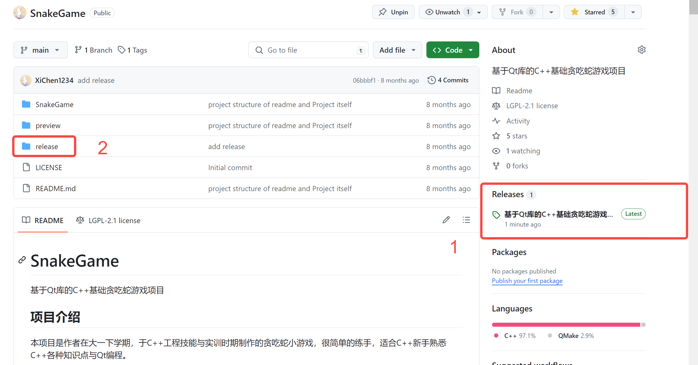
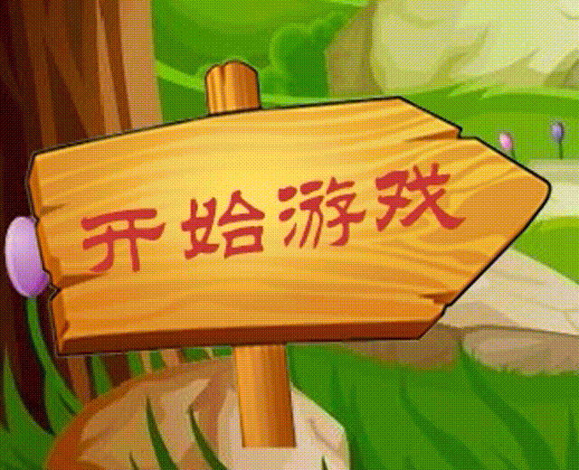
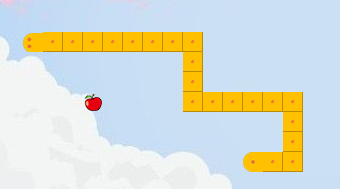
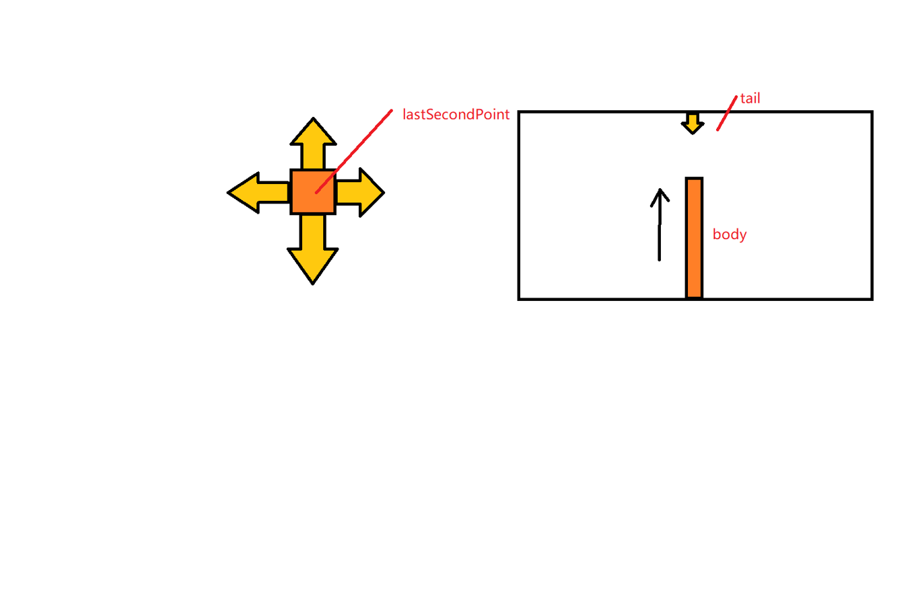
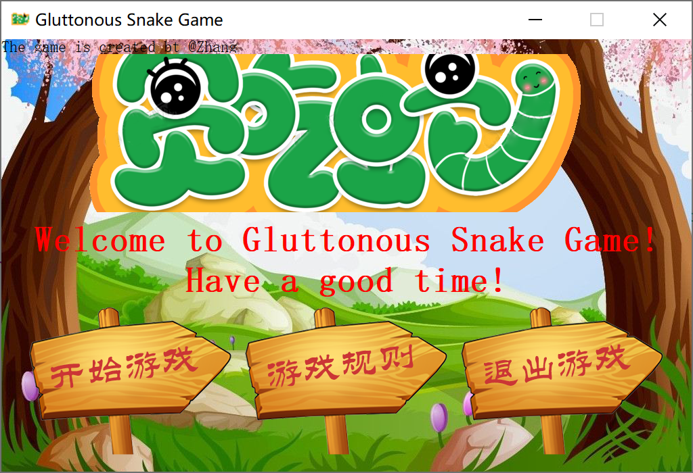
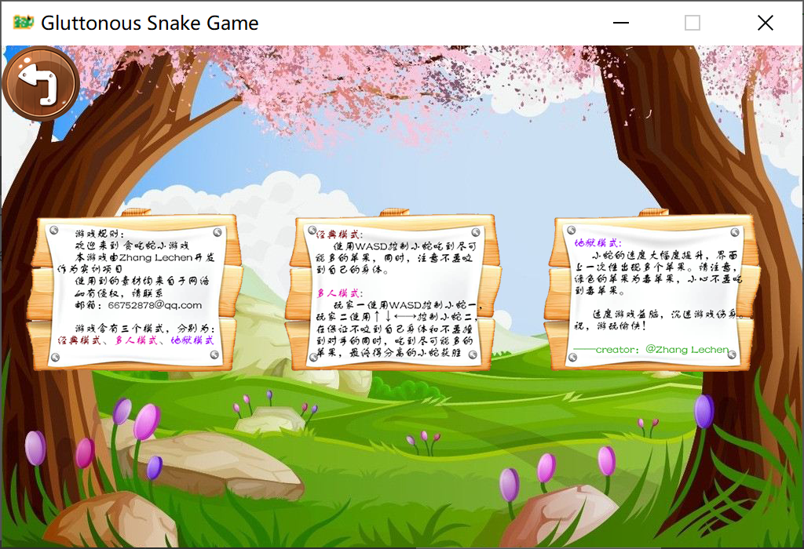
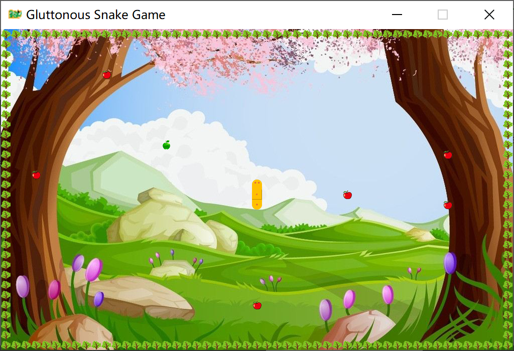

# 基于 Qt 库的 C++ 基础贪吃蛇游戏项目

最近在整理我之前做过的项目，翻到了大一时制作的贪吃蛇小项目。时间一晃而过，已经两年了。那会儿的我还是一个天天赶实验报告的小白……  这个项目是在学校大一下学期期末实训的时候，匆匆制作的。虽然时间非常赶，但是效果非常不错，还拿到了本次实训的“优”的评级，对于新手来说有一定的学习价值（对于大佬们来说就十分幼稚了）。当时的我刚刚接触编程，对于 C++ 还非常生疏，因此项目中有许多不符合软件开发规范的内容，还请诸位谅解。

未来如果有时间的话，我还会将这个项目进行重构优化。没有时间的话……就让它停留在这个最生涩的版本吧，毕竟这是我青春时鏖战了好几个晚上的成果，值得留恋。

# 项目简介

Qt 实训时制作的小项目，贪吃蛇小游戏。基于 Qt 库的很简单的练手项目，适合 C++ 新手熟悉 C++ 各种知识点与 Qt 编程。

项目仓库：[GitHub](https://github.com/XiChen1234/SnakeGame)


# 源码下载与发布版体验试玩

- 源码下载（对于软件开发者）
  - 如您是软件开发者，想要阅读源码或对本项目进行自定义配置或修改，请选择 master 分支下载最新源码，请确保你拥有 Qt 开发环境与 Qt Creator，或使用其他拥有 Qt 开发环境的编译器；
  - 解压下载好的 zip 包，或直接使用 Git 进行 Clone
    ```powershell
    git clone https://github.com/XiChen1234/SnakeGame.git
    ```
- 这里以Qt Creator为例，进入Qt Creator，点击左侧**打开项目**按钮，在文件资源选择器中选择`SnakeGame.pro`文件打开项目；


- 编译并启动项目


- 发布版体验试玩（对于游客）
	- 如您是游客，仅想体验一下本项目，请选择发行版下载最新发布版压缩包，或下载release文件夹中的压缩包。无需拥有Qt开发环境
		
	- 下载成功后，解压压缩包，点击文件夹中的`SnakeGame.exe`文件，即可进行游戏
		


# 项目重点亮点

## 按钮动画

鼠标在按钮上点击，按钮高亮，鼠标松开后，恢复正常；若正常点击按钮，按钮跳动，动画结束后，实行按钮功能



实现过程为：新建一个`MyPushButton`的类，继承`QPushButton`类。重写构造方法、鼠标点击事件、鼠标释放事件，并增添跳跃动画。

```cpp
// mypushbutton.cpp
#include "mypushbutton.h"

//MyPushButton::MyPushButton(QWidget *parent) : QWidget(parent)
//{

//}

MyPushButton::MyPushButton(QString normalImg, QString pressImg)
{
    //normal image path
    this->normalImg=normalImg;

    //press image path
    this->pressImg=pressImg;

    QPixmap pix;
    //loag normalImg
    pix.load(normalImg);

    //set fixed size
    this->setFixedSize(pix.width(), pix.height());

    //set style sheet
    this->setStyleSheet("QPushButton{border:0px;}");

    //set icon
    this->setIcon(pix);

    //set icon size
    this->setIconSize(QSize(pix.width(), pix.height()));
}

void MyPushButton::zoomDown()
{
    //create animation
    QPropertyAnimation* animation=new QPropertyAnimation(this, "geometry");

    //set time gap
    animation->setDuration(200);

    //start
    animation->setStartValue(QRect(this->x(), this->y(), this->width(), this->height()));
    //end
    animation->setEndValue(QRect(this->x(), this->y()+10, this->width(), this->height()));

    //set animation rules
    animation->setEasingCurve(QEasingCurve::OutBounce);

    animation->start();
}

void MyPushButton::zoomUp()
{
    //create animation
    QPropertyAnimation* animation=new QPropertyAnimation(this, "geometry");

    //set time gap
    animation->setDuration(200);

    //start
    animation->setStartValue(QRect(this->x(), this->y()+10, this->width(), this->height()));
    //end
    animation->setEndValue(QRect(this->x(), this->y(), this->width(), this->height()));

    //set animation rules
    animation->setEasingCurve(QEasingCurve::OutBounce);

    animation->start();
}

void MyPushButton::mousePressEvent(QMouseEvent *event)
{
    QPixmap pix;
    //load press img
    pix.load(pressImg);

    //set fixed size
    this->setFixedSize(pix.width(), pix.height());

    //set style sheet
    this->setStyleSheet("QPushButton{border:0px;}");

    //set icon
    this->setIcon(pix);

    //set icon size
    this->setIconSize(QSize(pix.width(), pix.height()));

    //let parent do other thing
    return QPushButton::mousePressEvent(event);
}

void MyPushButton::mouseReleaseEvent(QMouseEvent *event)
{

    QPixmap pix;
    //load normal img
    pix.load(normalImg);

    //set fixed size
    this->setFixedSize(pix.width(), pix.height());

    //set style sheet
    this->setStyleSheet("QPushButton{border:0px;}");

    //set icon
    this->setIcon(pix);

    //set icon size
    this->setIconSize(QSize(pix.width(), pix.height()));
    //let parent do other thing
    return QPushButton::mouseReleaseEvent(event);
}
```

## 蛇身控制

不同于互联网上普通的贪吃蛇教程，蛇身是由简单的小方块构成的。我的小蛇由三个部分组成：蛇头、蛇身、蛇尾，都有着不同运动方向的不同贴图。



实现过程为：创建 `MySnake` 类，继承 `Qwidget` 类，重写绘图事件，分别绘制头、身、尾。根据 `MySnake` 类中 `moveFlag` 成员变量判断蛇头方向、`MySnake` 中 `judgeSnakeTailDirection` 成员函数判断蛇尾方向



```cpp
// mysnake.h
#ifndef MYSNAKE_H
#define MYSNAKE_H

#include <QWidget>
#include <QList>
#include <QRectF>
#include <QPoint>
#include <QPainter>
#include <QPen>
#include <QtDebug>

enum Direction
{
    Dir_Up,
    Dir_Down,
    Dir_Left,
    Dir_Right
};

class MySnake : public QWidget
{
    Q_OBJECT
public:
//    explicit MySnake(QWidget *parent = nullptr);

    MySnake(bool secondSnake=false, bool hellSnake=false);

    bool secondSnake;
    bool hellSnake;//creat the wall

    QList <QRectF> snake;
    QList <QRectF> snake2;
    QList <QRectF> snake3;
    int node=20;

    int moveFlag=Dir_Up;
    int moveFlag2=Dir_Up;
    bool gameStart=false;
    bool gameOver=false;

    //move
    void addUp();
    void addDown();
    void addLeft();
    void addRight();

    void deleteList();

    void addUp2();
    void addDown2();
    void addLeft2();
    void addRight2();

    void deleteList2();

    //judge snake tail direction
    int judgeSnakeTailDirection();
    int judgeSnakeTailDirection2();

    //judge snake bite something
    bool judgeSnakeBite(QRectF rec);
    bool judgeSnakeBite2(QRectF rec);

    //judge snake bite itself
    bool judgeSnakeBiteItself();
    bool judgeSnakeBiteItself2();

    //judge snake bite another snake
    bool judgeSnakeBiteAnother();
    bool judgeSnakeBiteAnother2();
    bool judgeSnakeBiteWall();

    //paint event
    void paintEvent(QPaintEvent* event);

signals:

public slots:
};

#endif // MYSNAKE_H
```

## 双人游戏

由前段时间另一款小游戏产生的灵感，两位玩家分别控制一条小蛇进行吃苹果，当咬到自己、吃到毒苹果、撞到对手的蛇身/蛇尾上则死亡，最后较长者胜利


实现过程为：在 `MySnake` 类，加入一成员变量 `bool secondSnake`，用于判断当前页面是否为多人模式页面。若为 `true`，则构建 `snake2`，并进行绘图事件的重写。在 `MultiMode` 类中重写键盘事件，加入小方向键更改 `snake2` 的运动方向。在 `timeOutFun()` 中对蛇的运动状态进行更新，即可实现多人模式的编写

```cpp
// 由于该功能实现的过于复杂，在整个项目多出均进行了增加代码段，因此无法在这里简单演示。请下载项目源码后参考整个项目进行理解。在涉及双人模式代码段均有相关注释辅助理解
```

# 项目截图










# 项目总结

鸣谢：[bilibili](https://www.bilibili.com/)——[@C 语言实战大全](https://space.bilibili.com/1397938832)

学习视频地址：[【QT 项目】QT 项目实战：贪吃蛇项目丨完整详细视频教程，小白就业捷径](https://www.bilibili.com/video/BV1kW4y1b7ub)

我的项目仓库：[跳转项目 GitHub 仓库](https://github.com/XiChen1234/SnakeGame)

这个项目虽说是简单的练手项目，但对于当时的我，在初学 C++，不会指针不会 Qt 的我来说，还是较为困难的。但是这个老师的讲解深入浅出，分析明确，逐步开发的视频风格也帮助了我很多，更是让我在学校的实训中拿到了“优”的等级。我也仅仅是在老师的基础上增添了一些页面跳转、改了一些 UI 控件，加入了一些自己的思考、创新和实践，如果你喜欢我的项目分享，也请给这位老师一个大大的三连。
