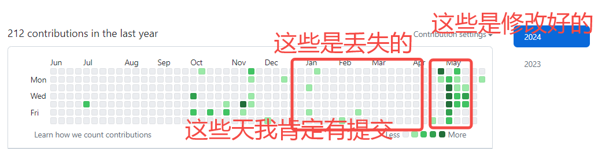
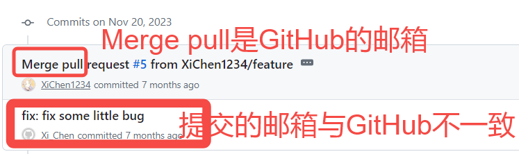
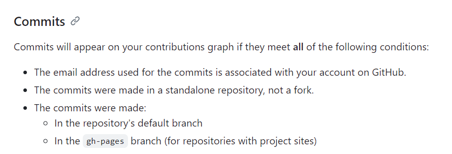

# 我的小绿点消失了 QAQ
记录一次GitHub贡献值消失的排查与修复的过程

# 察言观色

今天登录到 GitHub 上面，看到小绿点信息，觉得跟之前的提交的感觉不太一样——感觉少了很多的 commit！这怎么能行呢？这可是我的宝贵的小绿点啊！于是就开始了这次的排查



# 析毫剖厘

在网络上搜索之后，并且查看了我的提交记录，发现了我本次 Bug 的根本原因：**邮箱不一致**



根据 GitHub Contribution 官方文档的说明，由于我在本地设置的邮箱与 GitHub 邮箱并不一致，因此导致我的本地的邮箱的提交仅仅只能记录在仓库中，而无法被识别为我个人的贡献小绿点，以下是能够被记录的提交的规则：



# 对症下药

既然知道了这个问题的根本原因——邮箱不一致，那解决方法自然是将邮箱修改为一致即可。由于之前的各类仓库，太多太繁杂，全部修改没有意义，因此我觉得将时间太过久远的仓库全部放弃，仅仅留下体系化之后的项目：即 docsify-note 之后的所有项目将提交恢复即可。

## 打开仓库，运行脚本

对每个提交进行某个操作。Git 用到的命令如下：

```bash
git filter-branch -f --env-filter '具体脚本内容' HEAD
```

具体脚本内容如下：

```bash
#!/bin/bash
# 修改Author
if [ "$GIT_AUTHOR_NAME" = "Xi_Chen" ]; then #将Xi_Chen的邮箱和姓名全部替换
    export GIT_AUTHOR_EMAIL="xichen888.private@gmail.com"
    export GIT_AUTHOR_NAME="XiChen1234"
fi
# 修改committer
if [ "$GIT_COMMITTER_NAME" = "Xi_Chen" ]; then #将Xi_Chen的邮箱和姓名全部替换
    export GIT_COMMITTER_EMAIL="xichen888.private@gmail.com"
    export GIT_COMMITTER_NAME="XiChen1234"
fi
git filter-branch -f --env-filter '$0' HEAD
```
如果不想使用shell脚本，则使用Git命令如下：
```shell
git filter-branch -f --env-filter 'if [ "$GIT_AUTHOR_NAME" = "Xi_Chen" ]; then export GIT_AUTHOR_EMAIL="xichen888.private@gmail.com"; export GIT_AUTHOR_NAME="XiChen1234"; fi; if [ "$GIT_COMMITTER_NAME" = "Xi_Chen" ]; then export GIT_COMMITTER_EMAIL="xichen888.private@gmail.com"; export GIT_COMMITTER_NAME="XiChen1234"; fi' HEAD
```

对每个需要修改的仓库运行该脚本后，并重新强制提交 `git push -f`，刷新后即可发现小绿点统计正常了。


成功！
