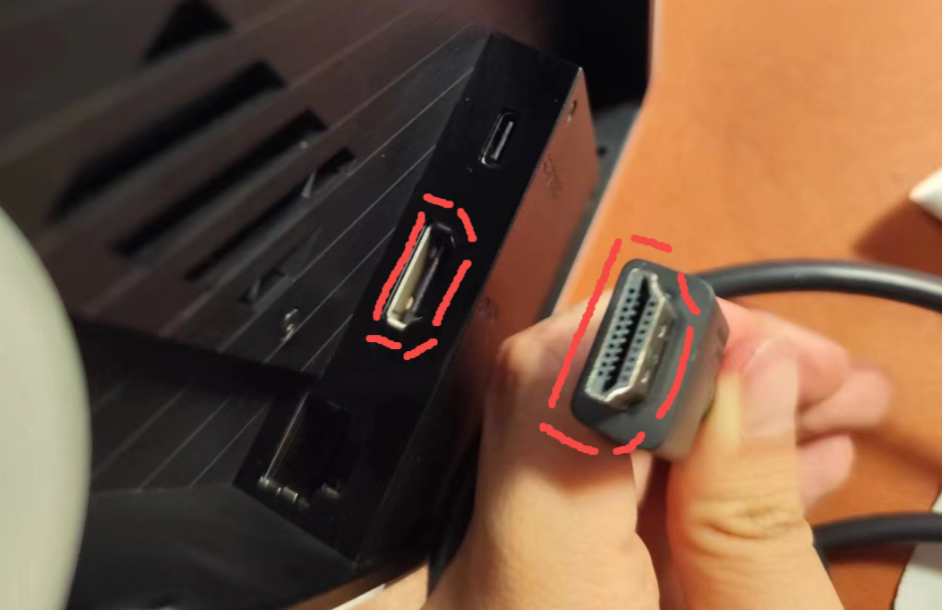
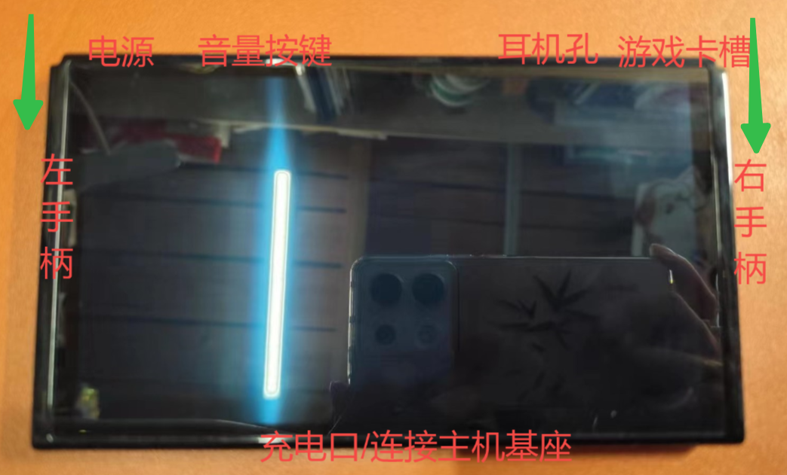
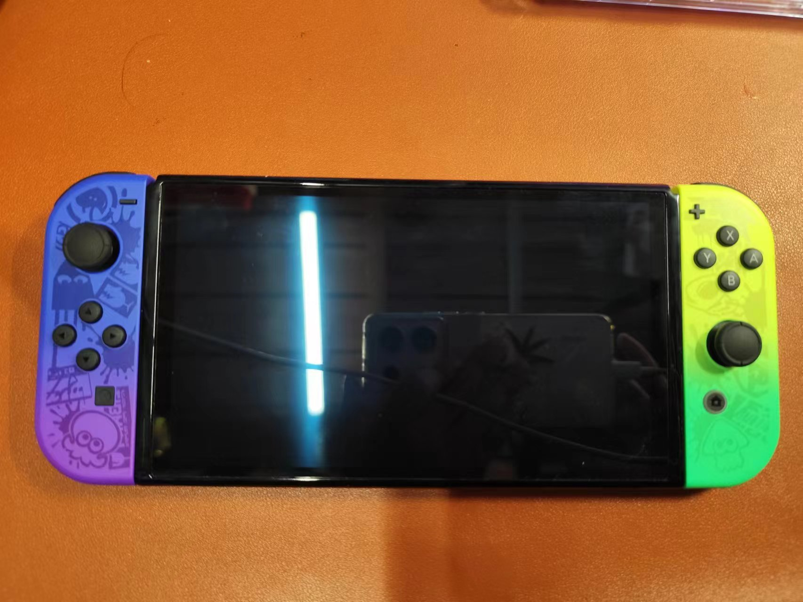
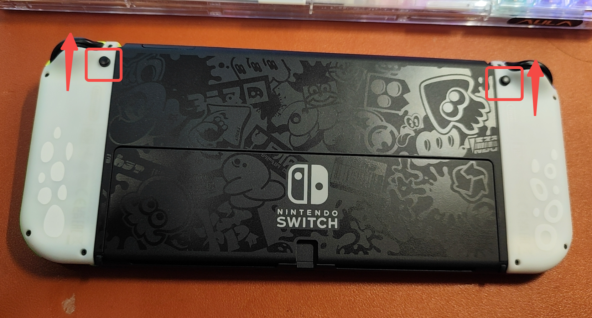
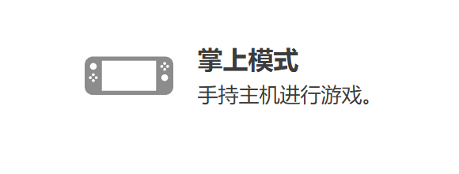
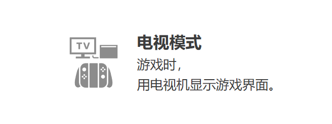
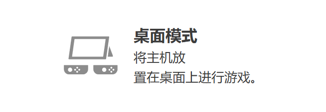
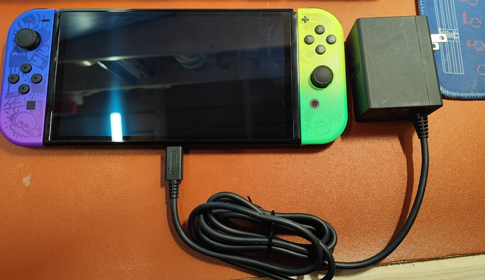
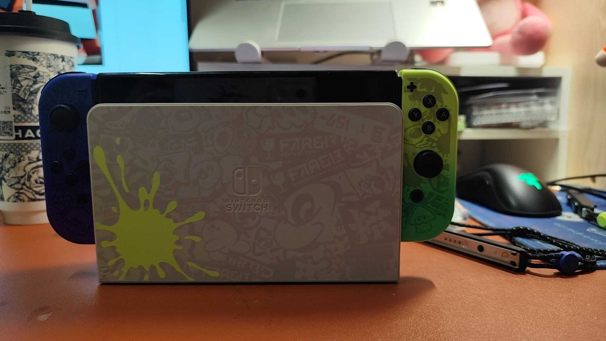
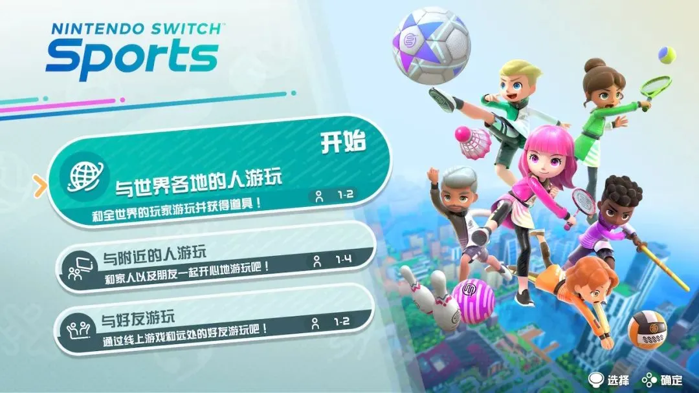

# “思维驰学习机”的基本安装与使用方法

> 注：标题“思维驰”为 Switch 的谐音梗，仅供娱乐，请勿当真

本篇文章基于任天堂官方文档，及作者使用习惯与互联网上公开的视频、图文资料整理而成，使用**“清清送晨晨的 switch - 喷射战士涂装”**进行演示（撒狗粮.jpg），介绍了 Switch 的基本安装与使用方法，希望对你有所帮助~

> 感谢我最美丽最可爱最温柔最宠我的女盆友，对本篇文章的鼎力支持！祝愿我的小宝贝天天开心！万事如意！一天比一天更美丽！
> 

# 主机构成及配件

## 主机 ×1

黑色 OLED 屏幕，表面有官方膜（据说不耐划，请勿使用尖锐物品或指甲直接接触以防划伤）

屏幕背部可以打开支架，支架可以以任何角度固定，将屏幕立在桌子上。支架打开后，内部有 sd 卡，插入可以提供额外的存储（我还没买）

---

## 手柄 ×2

分左右手柄，手柄有三种操作区域，摇杆、按钮和扳机。

手柄使用方式有以下三种：

---

手柄的拆卸也很关键，需要按压住背部保险按键，才能拆卸，请勿暴力拆卸，具体在“基本组合方式”中具体章节会讲解：[“思维驰学习机”的安装与使用方法](https://k1vrx6ifqoq.feishu.cn/wiki/NxN8wozb2iCNdIkpsluc3jphnle#part-DEzbdqejcogqagxR4tkcQ51Hn0g)

## 手柄挂绳 ×2

无左右挂绳区分，挂绳底部存在独立锁扣，**需要解开独立锁扣**才能插拔手柄，请勿暴力拆卸，安装方式需要格外注意

在游玩“Sports”游戏时**务必使用挂绳**，否则你的电视会有性命之忧。（最好在手柄取下来的时候，就使用挂绳）

## 手柄基座 ×1

就这个像大手柄的东西，可以将两个手柄放在这里组合成一个大手柄，方便使用

## 主机基座 ×1

用于放置主机，并提供电流、信号、网络等服务的基座

主机基座背部有一个白色盖板，可以轻轻抠开，但是要注意不要太用力损伤卡口

基座打开后，有以下三个接口：电源接口、HDMI 接口、网口，分别用来连接电源线、HDMI 高清线、网线

电源是必须插好的，其为整个基座提供了供电，当主机放在上面的时候可以进行充电。此时主机屏幕变黑，需要取下来才能看到

主机底部的充电口需要与基座底部充电桩对应

当插入电源与 HDMI 线的时候，主机将提供图像对外输出的功能，此时可以在显示器上看到主机的画面

网口提供有线网络连接功能，比 wifi 快

插上后，左下角圆环为线材整理通道，所有线材从此处引出。

注意：HDMI 线和网线是有正反区别的，请勿强行插入

## HDMI 高清线 ×1

略

## 电源线 ×1

略

# 基本组合方式

## 手柄 + 屏幕/手柄基座

将手柄与屏幕进行组装，是 Switch 最基本的使用形态。下面将介绍如何将其进行组合：

- 将屏幕按照如图方向进行摆放
  
- 将手柄分别于左右，从上向下，嵌入滑轨中进行安装，直到听到“咔嚓”一声，且手柄不再滑动，说明安装成功
  

下面将介绍如何将其进行分离

- 反转机器并找到手柄上的保险按钮
- 按住按钮并将手柄从下向上滑动，直到分离
  

手柄基座的安装和分离方式与此类似，这里不再赘述

## 手柄 + 手柄腕带

与手柄 + 屏幕的组合和分离方式类似，不同点在于：手柄腕带在最底部有一个卡扣，在安装的时候需要将其拨开、在分离的时候需要将其扣上。不要暴力插拔，以免损伤卡扣

## 屏幕 + 屏幕基座 + 线材

需要将屏幕基座的背板抠开，并将线材在背板中连接。同时，屏幕底座对准后插入，即可完成连接

# 三大使用模式

根据不同场景的特点，可以灵活选择 Switch 的使用模式，主要有以下几种

## 掌机模式

顾名思义，就是将机器捧在手里进行游玩，此时需要将屏幕和两个手柄进行贴合，如图

## 主机模式

将屏幕放在主机基座上，并将线材连接（至少连接电源线 +HDMI 线），HDMI 需要连接到外接显示器的 HDMI 接口中

然后将手柄取下或安装在手柄基座上，即可进行操控

**注：Sports 强制使用电视模式进行操作**

## 桌面模式

将屏幕背部支架打开，然后将手柄取下或安装在手柄基座上，即可进行操控

# 充电方法

Switch 的充电方法有很多种，如下：

- 直接充电
  
- 插入主机基座进行充电
  

# 游戏购买

## 查询最低价游戏的区服

这里我推荐 JUMP APP，他是一个游戏社区，可以搜索各类游戏、各平台中的的实时价格。可以通过这个 APP 搜索游戏最低价所在的地理区域

## 注册对应位置的任天堂账号

由于任天堂账号地理位置无法灵活更改（更改会清空余额，富哥可以随便改），因此在查询到低价区域之后要进行注册（注册一个即可，不用重复注册），注意地区一栏要选择你的目标地区，一个邮箱只能注册一个账户。随后将账户和 Switch 中的“用户”连接在一起即可进入 eshop

## 淘宝购买点卡

别选价格过低的，一般比当前实时汇率要高。比汇率还低的，有坑。

比如当前，1 人民币 ＝20 日元，因此一般购买 2000 日元价格在 105 元左右（举例），这 5 元人民币就是商家的利润。如果 2000 日元在 90 元甚至更低，说明商家已经亏了 10 元了，那他拿什么赚钱？只能说明其点卡来源有问题，可能会导致 Switch 机器被检测到异常行为被官方警告甚至锁机，得不偿失。

## 兑换余额并购买游戏

进入 eshop 个人中心，根据点卡兑换码充值余额后选择游戏进行购买。下载后就能开始游戏了。

# 可玩游戏（将持续更新）

目前我为我的 Switch 购入了两款游戏，他们分别是：

## Nintendo Switch Sports（任天堂 Switch 运动）

这款《NS 运动》囊括了六种运动项目，借助 Switch 手柄的陀螺仪和六轴定位功能，打造出新一代体感游戏。

本地化方面，任天堂一如既往的良心，不但有中文字幕、中文输入，还有中文语音，即使年龄较长的玩家也能毫不费力地游玩。

游戏方式上，支持本地双人、好友对战和网络排位等玩法，这也是时代进步的一大优势，即使你没有朋友，一样可以通过联网来体验人人对战的乐趣，这可不是人机游玩能比拟的，随机匹配到的高手比比皆是，也给我们提供了更加充足的动力。

本地游玩请选择第二项“与附近的人游玩”，正常 1~2 人。最多支持 4 人游玩，但需要两幅 joy-con。**玩时请注意绑好腕带，避免脱手发生事故**。

下面我简单介绍一下这六款游戏：

### ~~排球（没玩过）~~

略

### 羽毛球

我们只需要把球打回去就行，陀螺仪默认的是中心，可以通过手柄在身体的方位来形成正拍和反拍，需要根据对方打球来与自己当前的相对方位来选择，挥动手柄的速度决定了击球力量，挥动越快，越容易打出扣杀

### 保龄球

ZR 放在胸前，角色就会提起球做准备，可以通过方向键调整左右站位，将虚线对准球瓶做掷球动作即可，注意全程不要放开 ZR 键。

### 足球

足球一个人需要 2 个手柄进行操控。因此没法双人 1v1，但是可以和电脑进行对战。左摇杆配合角色跑动、右摇杆旋转角色视角，然后右手柄挥动踢球，向上下左右挥动能够踢出不同方向的球，同时下挥双手柄使出“鱼跃冲顶”

### 击剑

主视角状态下，我们要旋动手柄摆好自己的姿势。有竖向、横向、斜向三种，观察对手的攻击方式，进行相应的防御，防守成功之后，对手头上冒出星星，进入晕眩状态，这时候可以挥动手柄进行攻击。

注意：刺剑能被任何防御防住，最好不要选择

如果是本地 1v1 的话，无法游玩双手剑，可以玩单剑和蓄力剑，二者的区别是蓄力剑可以在防御成功后积攒 1 次能量条，2 次积攒后可以按住 ZR 扳机使用蓄力斩

### ~~高尔夫球（玩不懂）~~

略

### 网球

游戏中玩家同时控制前方和后方的两名选手，击球时两人都会挥拍，由于是 AI 跑位，大家主要根据网球的影子来控制落点，决定击球的方向和力量。

相比羽毛球，网球更加有速度和力量感，视觉冲击力也更强。虽然比较简单，却是笔者最喜欢的项目。

### 总结

游戏的玩法上主要是手臂挥动，实际上对脚步的要求不多，更适合全年龄一起玩，均衡锻炼可以左右手交换着来。由于是模拟运动，并不会像现实运动一样，比如接触到球后会有反馈（仅仅使手柄震动一下），因此可能用力过猛或游玩时间过长可能会造成肌肉拉伤或肌肉损伤，注意休息。

**再次提醒系好腕带。**

## Unravel Two（毛线小精灵 2）

《毛线小精灵》是一款横版双人合作游戏，有着出色的操作手感及物理引擎和文艺范十足的剧情表现方式。游戏中玩家将扮演从毛线团中诞生的生物「亚尼（Yarny）」，这个浑身毛线的小人将在拟真的游戏中进行冒险，它一边前进，一边拖着背后长长的毛线，它可以消耗身上的毛线前进、攀高或架桥，玩家需要在毛线消耗完之前到达下一个毛线补充点。在此中间，玩家还会遇到各类障碍，需要运用自己的智慧破解各类难题。

游戏为英文，无汉化。不过由于游戏中对话几乎没有，因此不影响正常游戏游玩。

缺点：Switch 由于性能原因，画质不太好 QAQ，我应该在 PS5 上买的 QAQ

# 结语

在探索了 Switch 游戏机的多种功能和娱乐方式后，我们不难发现，这不仅仅是一台游戏机，更是一个多功能的娱乐平台。它不仅能够提供沉浸式的游戏体验，还能通过其社交功能让我们与朋友和家人保持联系，甚至通过健身游戏鼓励我们保持活力。无论是在家中享受宁静的游戏时光，还是在旅途中寻找乐趣，Switch 都能满足我们的需求。

记住，使用 Switch 游戏机的关键在于平衡。虽然游戏可以带来无尽的快乐，但我们也要注意不要过度沉迷，确保游戏时间不会影响我们的日常生活和健康。同时，利用 Switch 的多样性，尝试不同的游戏和应用，让娱乐更加丰富多彩。

最后，不要忘记 Switch 游戏机的核心——那就是娱乐。不管是独自冒险，还是与朋友一起合作，Switch 都能让你的游戏体验更加完美。所以，拿起你的 Switch，开始你的娱乐之旅吧！

> 感谢我最美丽最可爱最温柔最宠我的女盆友，对本篇文章的鼎力支持！祝愿我的小宝贝天天开心！万事如意！一天比一天更美丽！
> 