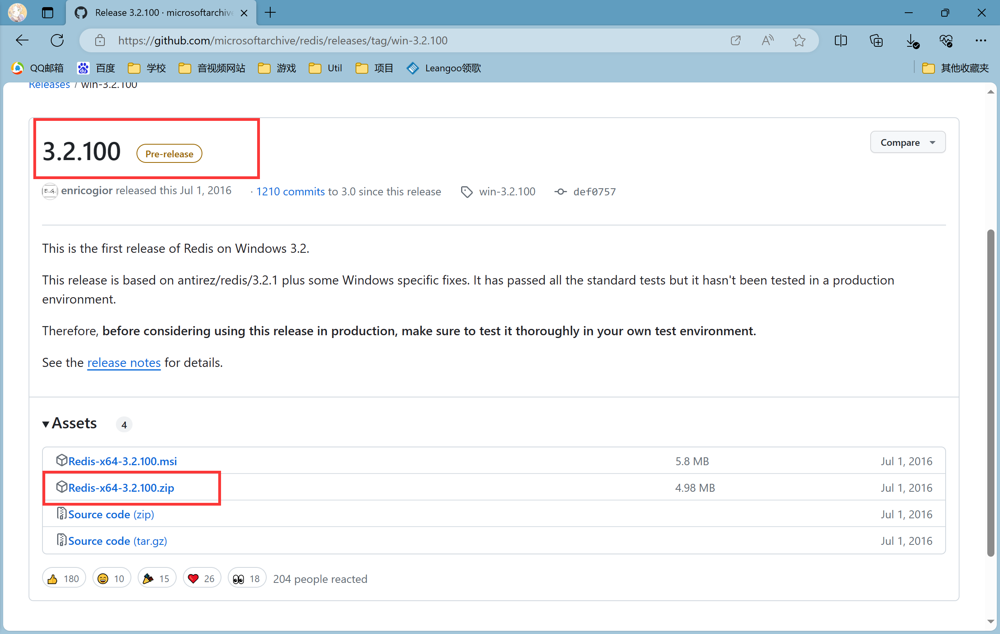
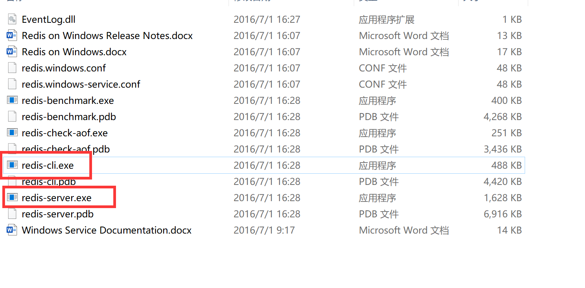
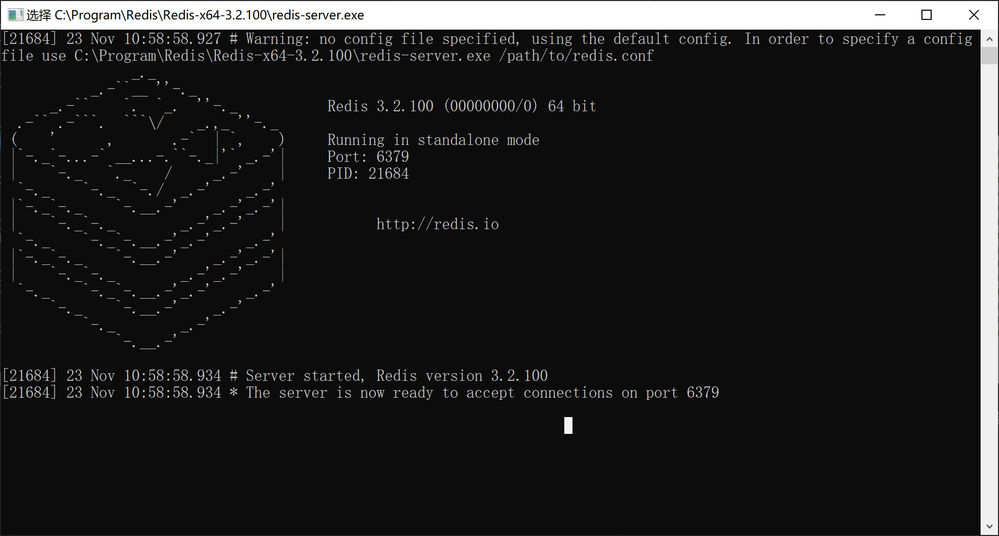
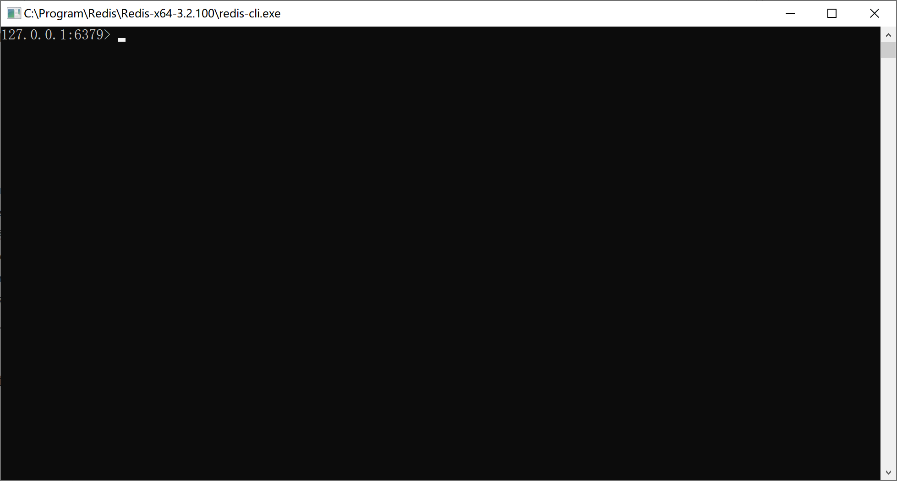

# Windows 安装 Redis（临时使用）

在进行 CompKey 实验的过程中，没有部署远程 Redis 单体服务器，但是需要检查本地代码是否能够连接和访问 Redis 服务器进行数据存取，因此需要临时在 Windows 上安装 Redis 进行实验

# **下载**

> 下载地址：[Redis 官网下载地址](https://github.com/microsoftarchive/redis/releases/tag/win-3.2.100)

点击下图下载压缩包到 windows 本地



# **解压后启动**

解压后有以下目录的文件：



先启动服务端 `redis-server.exe`，再启动客户端 `redis-cli.exe`，可见以下窗口。





可以输入几行代码测试是否成功连接：

```bash
127.0.0.1:6379> ping                # 测试连接情况
PONG                                # 联通
```

# 在 Windows 上简单使用 Redis

```bash
127.0.0.1:6379> set name xichen     # 设置kv键值对，<name, xichen>
OK                                  # 成功
127.0.0.1:6379> get name            # 通过k获取v
"xichen"                            # 显示v
127.0.0.1:6379> del name            # 删除k
(integer) 1                         # 删除成功，影响行数1
127.0.0.1:6379> get name            # 通过k获取v
(nil)                               # 为空
```
