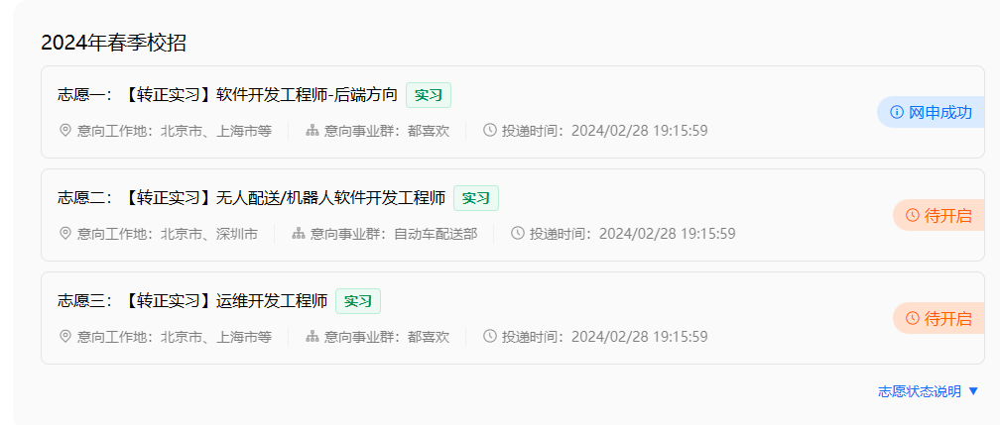
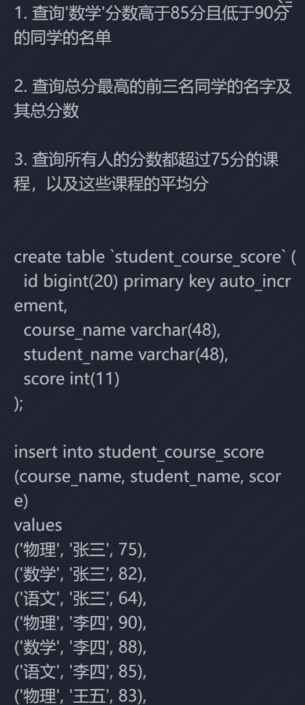
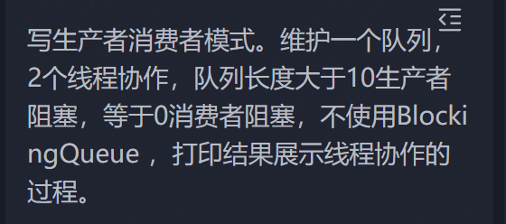

# （已接 Offer）美团暑期实习面试全流程

# 2024.2.26

听了美团的线上宣讲会，准备投递美团的岗位，就算拿不到美团的实习资格，也能积累大厂面试的实际经验，了解实习招聘流程

- 转正实习：其实就是暑期实习，后续正在问

  > 暑期来实习，满两个月后可提留用转正，拿 25 届正式校招 offer，后续是否继续实习到毕业看个人安排。23 届转正率 73%。今年基本原则是满足工作要求的【应留尽留】
  >
- ~~日常实习：啥时候的可以投的，暂时不用关注。~~

## 实习类别

- 自然语言处理算法工程师
  - 北京
- **运维开发工程师**
  - 北京、上海、深圳
- ~~运筹优化研发工程师~~
- ~~搜索推荐算法工程师~~
- ~~计算机视觉工程师~~
- ~~机器学习/数据挖掘算法工程师~~
- 测试开发工程师
  - 北京市、上海市、成都市、深圳市
- ~~安全工程师~~
- **软件开发工程师 - 后端方向**
  - 北京市、上海市、成都市、深圳市
- ~~软件开发工程师 - 数据开发方向~~
- 软件开发工程师 - 前端 & 移动端方向
  - 北京市、上海市、成都市
- ~~大模型后台开发~~
- 大模型测评算法工程师
  - 上海市
- 大模型数据算法工程师
  - 北京市、上海市
- ~~大模型算法工程师~~
- ~~大数据基础架构工程师~~
- ~~电池大数据算法工程师~~
- ~~机器学习引擎工程师~~
- 视频编解码算法工程师
  - 北京市
- **无人配送 / 机器人软件开发工程师 - 后端方向**
  - 北京市、深圳市
- ~~无人配送 / 机器人软件算法工程师~~
- ~~音视频工程师~~
- ~~硬件开发工程师（电子电路开发方向）~~
- ~~硬件开发工程师（机械与结构开发方向）~~
- ~~硬件开发工程师（嵌入式系统软件开发方向）~~
- ~~语音算法工程师~~
- 自动驾驶算法工程师
  - 北京市、深圳市
- 自动驾驶系统工程师
  - 北京市、深圳市

**评价：**

详细建议已经问了学长，目前正在等待答复中。整体来看，我能做的岗位还是太少了。以至于我现在开始焦虑我要不要考研了 QAQ。。。好多岗位都是硕士起步开始做的啊。

目前用到的技术栈还是 Java 最管用，然后就是 C/C++，然后是前端的那些乱七八糟的语言和框架，看来后面打造简历还是要以 Java 为主。Java 后端的项目得加紧“圆谎”了。

## 已投递

# 2024.3.9

参加笔试了，大概率寄，服了。。。好难

# 一面 2024.3.21

上来先进行自我介绍，随后面试官对我的天基项目感兴趣，我做了个数据库重构，于是以此出发，问了数据库相关的内容。

- MySQL 如何实现文档型数据库（我项目里用到了 MongoDB）那样文档嵌套的效果（不使用外键的条件）
- MySQL 的事务，有了解吗？

然后写了三个 SQL 题目，SQL 还是有一些遗忘

然后让我利用索引对写好的 SQL 语句进行调优

随后问了一些计算机网络的问题

- HTTP 请求和响应的结构是什么样子的
- HTTP 中 Get 和 Post 方法有什么区别，提到了安全上的区别
- 如何将 Post 请求变成安全的
- 如何将非 HTTPS 的请求的内容非法窃取

框架的问题

- Spring 和 Servlet 是什么关系呢？
- Spring 是如何代理 Servlet 呢？是一个请求一个 Servlet 还是多个请求由一个 Servlet 代理处理呢？

然后是一道算法题，是二维数组深度优先搜索的问题，题目：

> 给一个 0/1 矩阵，1 代表是陆地，0 代表海洋， 如果两个 1 相邻，那么这两个 1 属于同一个岛。我们只考虑上下左右为相邻。
> 岛屿: 相邻陆地可以组成一个岛屿（相邻:上下左右） 判断岛屿的形状。  
> 输入  
> int[][] grid1 = {    
> { 1, 1, 0, 0, 0 },  
> { 0, 1, 0, 1, 1 },  
> { 0, 0, 0, 1, 1 },  
> { 0, 0, 0, 0, 0 },  
> { 0, 0, 1, 1, 1 }  
> };  
> 输出：  
> ["0,0", "0,1", "1,1"]  
> ["1,3", "1,4", "2,3", "2,4"]  
> ["4,2", "4,3", "4,4"]  
>
> ---
>
> 输入：  
> int[][] grid2 = {  
> { 1, 1, 1 },  
> { 0, 1, 0 },  
> { 1, 1, 1 }  
> };  
> 输出：  
> ["0,0", "0,1", "0,2", "1,1", "2,0", "2,1", "2,2"]

一遍过

最后结尾的时候：有什么项目能够运行让我看一下呢？给他看了我的个人主页，原本那是为了前端职位准备的，做的花里胡哨的

反问：

- 技术部门方向：各类细分方向
- 合作规模：50 人左右
- 程序员的水平大概是要求什么程度

## 过啦！

# 二面 2024.3.25

面试官上来先对自己的业务进行介绍，随后让我进行自我介绍。

在项目沟通的过程中，对我阿里云 OSS 故障的经历表示感兴趣，让我展开说说，以及在这个故障的经历中学到了什么

然后就是简历里面提到的一些内容，基本都是我讲，他在听

随后说要给我出题，问我一面中 SQL 题有问题没，我说第三个没做的出来，他说后来下来看了吗，我说看了，他说那就做一下

SQL 做的挺顺利，他大概看了一下就过了。然后又出了一道题

这个时间在 10min 左右，说时间有限给我打断了，随后就让我讲下思路

然后就是针对简历进行八股的询问

- 对于这个多线程方面，刚才看你写的过程中最开始用到了 new 一个 Thread，随后删了又改用实现 Runnable 接口，最后又删掉写了 lamda 表达式，能说下你的心里思路吗？（讲了多线程实现的几种方式）
- 如果我在 new Thread()的括号内部 new 一个 Runnable，这个方式和刚才你讲到的方式有什么根本上的区别？
- Redis 用过是吧？那 Redis 为什么这么快，除开他是基于内存的之外，还有什么原因？（我八股背了一波，然后他后面还深层次的拷问，我就只能说没有深入理解，只是用 Spring 框架简单整合了一下，实现功能而已）

（看我数据库这方面答得不太好，于是迅速转移话题）

- Java 中的各类集合关系，能说一下吗？你在实际开发中分别在哪些应用场景用过呢？
- TCP 中有个 time wait 的概念，说下出现这个概念具体的原因？（这个答得有点呲）
- 四次挥手可以设计成三次吗？
- Linux 中“一切皆文件”，能说下 Linux 操作系统打开文件的一个过程吗？

反问环节：

- 就刚才那个面试题，其实我在学习设计模式的时候也有相应的疑问。刚才那个设计模式因为是很久以前在课程上学习过写过代码，但是在近期几个学期的项目中都没怎么用到设计模式中学习到的知识，因此刚才也不是很熟练，您看我刚才思路应该是没问题的。我想问一下，在常规的工作中，用到设计模式的场景多吗？还是说我做项目的层次比较低，才会导致用设计模式用的比较少？（自认为（bushi）巧妙的化解了自己没做出这个题的窘迫）
- 后续的面试流程还有几轮？（技术面最后一轮，hr……如果你过了筛选的话，hr 后面会和你沟通），这里其实能看出来潜意识可能也比较认可我了

# 拿到 Offer！接了！

暑期入职，开启新篇章！

岗位/部门：公司/美团/优选事业部/研发部/平台研发组/财务研发组

入职时间：暂定 2024 年 6 月 28 日

入职地点：北京市朝阳区小莹北路北侧 6-1 号定成时代广场 D 座 2 层员工服务中心
